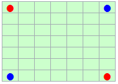
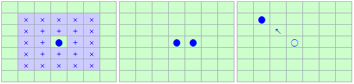
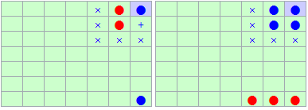
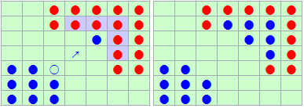

# 2020-KAIST-Postech-AI
2020 카이스트-포스텍 학생대제전의 AI 종목에 출전한 인공지능 에이전트입니다.

## 게임 규칙

**ATAXX (세균전)**

* 아래 그림처럼 7x7 판의 꼭지점에 말을 배치한다.
  
* 말은 자신의 말에서 한 칸 혹은 두 칸 거리에 있는 빈 칸(아래 그림에서 연파랑 바탕으로 된 칸)에 놓을 수 있다. 가로·세로·대각선으로 한 칸 떨어진 곳(+표시한 부분)은 그 곳에 말을 더 놓을 수 있고, 두 칸 떨어진 곳(x표시한 부분)은 그 지점으로 말을 옮겨 놓아야 한다.
  
* 두 칸 떨어진 곳으로 이동할 때는 이동하는 길목이 막혀 있어도 이동하려는 칸만 비어 있다면 무방하다. 아래 그림에서 연파랑 바탕으로 표시된 곳의 파란색 말은 x표시된 지점으로 이동할 수 있다.
  
* 말을 둔 곳으로부터 인접한 지점(가로·세로·대각선으로 한 칸 떨어진 곳)에 상대방의 말이 있을 경우 그 말은 모두 자신의 말로 바뀐다. 예를 들어, 파란색 말이 아래 그림처럼 이동한 경우, 그 주변의 빨간색 말(연파랑 바탕으로 표시된 말)은 모두 파란색 말로 바뀐다.
  
* 양쪽 모두 더 이상 둘 곳이 없으면 게임이 끝난다. 그 조건은 다음과 같다.
  - 말이 판 전체에 가득 찬 경우
  - 어느 한 쪽이 상대방의 말을 모두 따 낸 경우
* 만일 어느 한 쪽이 상대방을 완전히 포위해서 상대방이 더 이상 둘 곳이 없다면, 나머지 칸을 포위한 쪽의 말로 채우고 게임을 끝낸다.
* 게임이 끝난 경우, 말의 개수를 비교해서 많이 있는 쪽을 승자로 한다.

## 개발 환경

* Windows 10 - 64bit
* Python 3.7

## 실행 방법

* 대결을 원하는 에이전트들의 이름을 ai1.py와 ai2.py로 설정
* ataxx.exe와 같은 디렉토리에 넣기
* ataxx.exe를 실행하여 log.txt가 생성

## 팀 내 AI 리스트

### Random Agent

제작자: 정상현

AI 성능 비교를 위해 만든 Random한 Valid Action을 수행하는 에이전트.

### AlphaBeta Agent

** 대회 출전 **

제작자: 정상현

Alpha-Beta Pruning 알고리즘을 적용한 에이전트. State의 Heuristic Value는 말의 개수의 차이로 설정.

### MCTS Agent

제작자: 정상현

Monte Carlo Tree Search 알고리즘을 적용한 에이전트. Simulation Step은 Random Agent로 진행.
